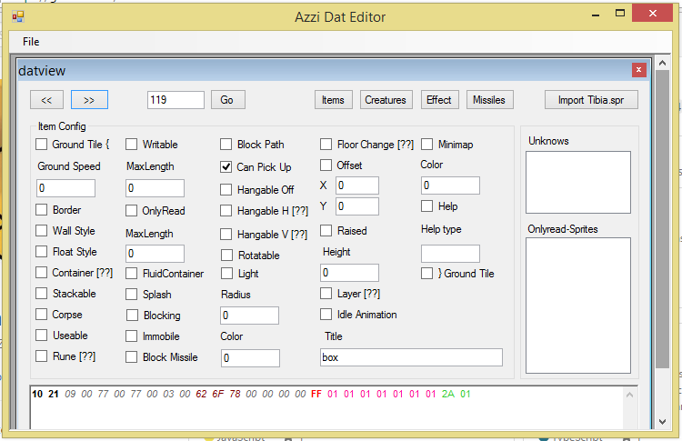

# Azzi Dat Editor

## História
Na época em que tibia 8.7 havia sido lançado, o desenvolvedor Black Demon havia anunciado a sua
"aposenteadoria" do mundo Open Tibia, com o qual ele colaborava na época com um software conhecido
como Dat Editor: permitia ao manutenedor de OT Server a capacidade de alterar informações de itens,
como o brilho, o deslocamento da imagem, se ele era rotacionável (para que isso aparecesse no menu),
se era um piso, se impedia o movimento, entre outras coisas.

Com a falta de um Dat Editor mantido por alguém, o mundo dos servidores Open Tibia havia entrado
em colapso: depois da versão 8.6 não era mais possível alterar muitas coisas nos OT Servers em
termos de adições de itens e monstros, então começaram a existir duas frentes: OTs criativos,
baseados em Tibia 8.6, com alteração de itens e personalizados e servidores globais, que seguiam
a versão to tibia normal.

Durante a versão 9.0 do tibia eu mandei alguns e-mails para que Black Demon voltasse a ativa como
desenvolvedor Open Tibia e lançasse um novo Dat Editor compatível com as novas versões, mas fui,
naturalmente ignorado.

Em 2011 a versão do Tibia era 9.6 e eu resolvi que eu mesmo deveria aprender a fazer uma Dat Editor,
já que no passado já havia feito um descompressor de sprites, não podia ser muito diferente.

Abri os fonts publicados por Black Demon, um código C++ cavernoso, complicado, mas de lá fui entendendo
as regras de negócio da composição do arquivo Dat Editor e como os bytes se organizavam dentro dele,
e este software foi meu desenvolvimento mais próximo de um Dat Editor que consegui chegar na época.

Não se trata de um Dat Editor, mas sim de um Dat Reader, por que foi até onde cheguei. Ele não faz
alteração no arquivo Dat, mas deixa colorido os bytes dizendo o que cada um deles querem dizer
dentro do arquivo e, então, com um editor hexadecimal, você deve abrir o Dat Editor e manipular
byte a byte para depois salvá-lo e depois ver se tudo que foi alterado está funcionando.

Na época, me ajudou a criar o Time Travel Open Tibia Server, que não ficou mais do que seis meses
no ar, em um servidor Ubuntu.

## Informações técnicas
Este Dat Reader publicado tem por único objeto servir como base de construção de novos Dat Editores
futuros, para programadores que assim desejarem fazer, uma vez que o funcionamento deste é
explicitamente para Tibia 9.6, o que não é muito útil.

Ao abrir o arquivo .DAT, ele irá exibir um conjunto de bytes referente a cada item que compõe um
dos itens do arquivo. Estes bytes estarão coloridos em cores que tem representatividade:
 * Cinza e preto querem dizer a mesma coisa, mas alterno entre elas para que seja identificável o fato de se tratam de parâmetros diferentes. Um parâmetro é uma caracteristica do item, os nomes estão nas checkbox marcadas na imagem do que representam, os que tem interrogação são os que não tive como ter certeza de que realmente se tratava daquilo.
 * A cor marrom é a representação de argumentos recebidos por um determinado parâmetro, por exemplo: seu item ter luz é um parâmetro, a cor desta luz e qual o raio que ela alcança são dois argumentos, sendo que estes argumentos podem ocupar de um a dois bytes.
 * O caracter vermelho FF indica que os parâmetros foram encerrados e que agora serão consideradas as imagens que fazem parte deste item / monstro / magia. O FF faz parte da enumeração de parâmetros, e isso faz com que a ocorrência dele possa acontecer sem que represente o fim dos parâmetro, no caso dele aparecer como argumento, como no caso da luz ter sua tonalidade de cor ou raio 0xFF, que seria lido como um valor numerico.
 * Os bytes de cor rosa são formas de dizer quais são as caracteristicas das imagens que se seguiram, se elas são uma animação continua, se representam um monstro que pode se virar para frente, trás, lados, se representa situações diferentes de uma mesma coisa.
 * Os bytes de cor verde claro e verde escuro representam posições das imagens daquilo que está sendo representado, eles se agrupam de dois em dois e resultam em um valor short, indicando o indice no Tibia.spr da imagem vinculada a este item.